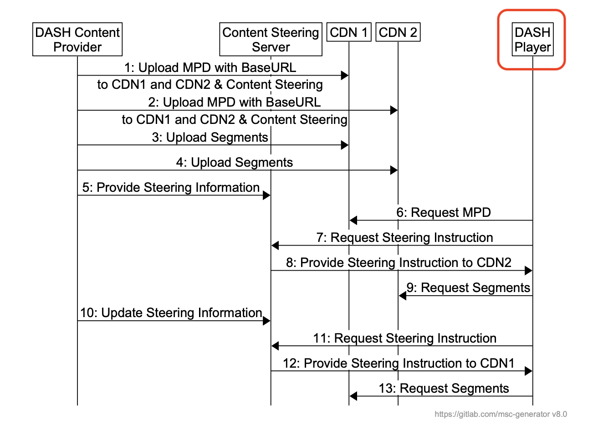

- Feature Name: Content Steering
- Start Date: 2023-07-31
- PR: https://github.com/videojs/rfcs/pull/1

# Summary
[summary]: #summary

Content distributors often use multiple Content Delivery Networks (CDNs) to distribute their content to the end-users. They may upload a copy of their catalog to each CDN, or more commonly have all CDNs pull the content from a common origin. Alternate URLs are generated, one for each CDN, that point at identical content. Streaming players may then access alternate URLs in the event of delivery problems.

Historically, alternate URLs have been features of both HLS and DASH for many years, but they only provide means of failover controlled by the player, and not by the content distributor.

Content steering describes a deterministic capability for a content distributor to switch the content source that a player uses either at start-up or midstream, by means of a remote steering service.

# Motivation
[motivation]: #motivation

Content steering is a relatively new mechanism to allow content distributors greater control over where a player or end-user accesses their HLS or DASH media from, which can be leveraged to provide a better quality of experience. This feature has been implemented by other leading players in the industry and should also be adapted for video.js.

# Guide-level Explanation
[guide-level-explanation]: #guide-level-explanation

Content steering provides the means, through a content steering server and subsequent content steering manifest, of externally controlling where the player will fetch content segments from. The information about where to fetch the content steering manifest, as well as which CDN to fetch segments from is provided by new tags in both HLS and DASH manifests, `#EXT-X-CONTENT-STEERING` and `<ContentSteering>`. Additionally there may be properties added to existing tags, or their uses may be modified to accomodate identification of a specific CDN to fetch segments from. 

The Content Steering manifest is provided as a URI adjacent to these tags, with the expected response to be an object which generally looks like this:

```json
{
 "VERSION": 1,
 "TTL": 300,
 "RELOAD-URI": "https://steeringservice.com/app/instance12345?session=abc",
 "CDN-PRIORITY": ["beta","alpha"]
}
```
This manifest provides further information about how frequently to refresh the steering manifest `TTL` in seconds, where to reload the steering manifest `RELOAD-URI` (optional), and the `CDN-PRIORITY` a priority-ordered array, which in this case is a descriptive term to represent **both** HLS and DASH implementations, which are represented as `PATHWAY-PRIORITY` and `SERVICE-LOCATION-PRIORITY` respectively.

With this feedback from the content steering server, the player can then follow the prescribed content steering logic outlined in each spec to determine the where to fetch segments and when and where to fetch the next steering manifest.

An example of how a typical interaction with the player, steering server and multiple CDNs is provided from the DASH IF spec.



For more details on how this accomplished for each format, see the appropriate specification:
* [HLS Content Steering Specifiation](https://developer.apple.com/streaming/HLSContentSteeringSpecification.pdf)
* [DASH Content Steering Specification](https://dashif.org/docs/DASH-IF-CTS-00XX-Content-Steering-Community-Review.pdf)

# Reference-level explanation
[reference-level-explanation]: #reference-level-explanation

To implement this feature in video.js, there will be 4 main components.
* Parse `#EXT-X-CONTENT-STEERING` tags and associated properties in the m3u8-parser and expose them in the manifest object.
* Parse `<ContentSteering>` tags and associated properties in the mpd-parser and expose them as well.
* Add the ability to process the associated tags in VHS and request and refresh the content steering manifest.
  - This would likely occur at the playlist-loader level as to more easily separate the DASH and HLS specific logic.
* Process the content steering manifest and apply steering logic to both DASH and HLS content.
  - This logic can be applied in common areas where applicable, but should be pushed up into the respective loaders when required.

Both specifications (linked above) enumerate detailed steps on the required logic for handling both the steering manifest, new tags and associated properties. This logic must be implemented in a way specific to each format when necessary. For example, if required, [HLSv2 7.2 has specific requirements for pathway cloning](https://datatracker.ietf.org/doc/draft-pantos-hls-rfc8216bis/).

# Drawbacks
[drawbacks]: #drawbacks

* This may not be a useful feature for *all* users of video.js.
* The work required is substantial.
* Could potentially cause regressions in core libraries such as the parsers or VHS. 

# Rationale and alternatives
[rationale-and-alternatives]: #rationale-and-alternatives

* This design is the most applicable to our current architecture, the details about which specific class to implement the may change as development progresses, but the main components will remain the same.
* A separate content steering parser is an alternative that could keep some of the logic out of VHS for more clarity, but may not be necessary due to the small amount of parsing required.
* Not developing this feature could put is behind some of the other open source players available.

# Prior art
[prior-art]: #prior-art

* This feature is already implemented in DASH.js and hls.js, both can be a useful reference.
* This feature is currently being discussed with the research team at Brightcove and has been the subject of papers being presented at video industry conferences such as IBC and demuxed.

# Unresolved questions
[unresolved-questions]: #unresolved-questions

* VHS specific implementation details, where should the steering manifest request and parsing logic live?
* How to best separate HLS and DASH steering logic?
* Are some of the optional HLS features, such as pathway cloning necessary for a phase 1 of this feature?
* How can we best provide a reliable, working demo of this feature once complete?

---
### Sources

HLS:
1. https://developer.apple.com/streaming/HLSContentSteeringSpecification.pdf
2. https://datatracker.ietf.org/doc/draft-pantos-hls-rfc8216bis/

DASH:
1. https://dashif.org/docs/DASH-IF-CTS-00XX-Content-Steering-Community-Review.pdf

### Credits
Yuriy Reznik, Guillem Cabrera
