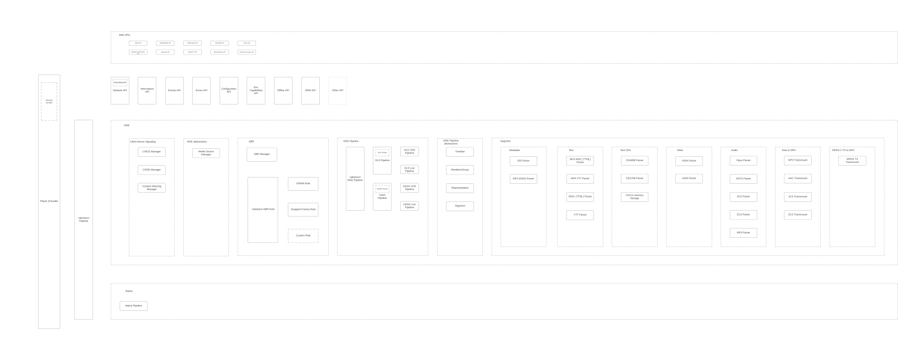
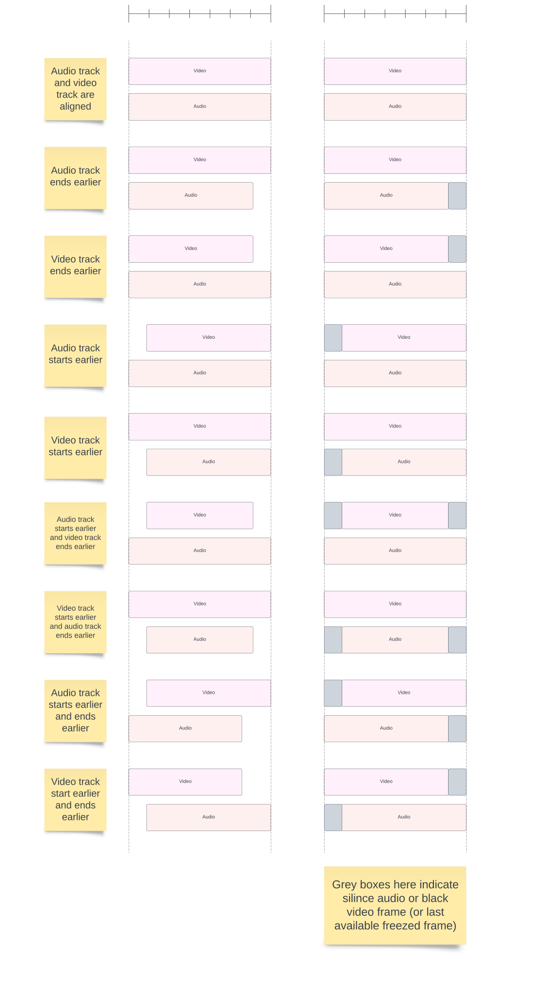
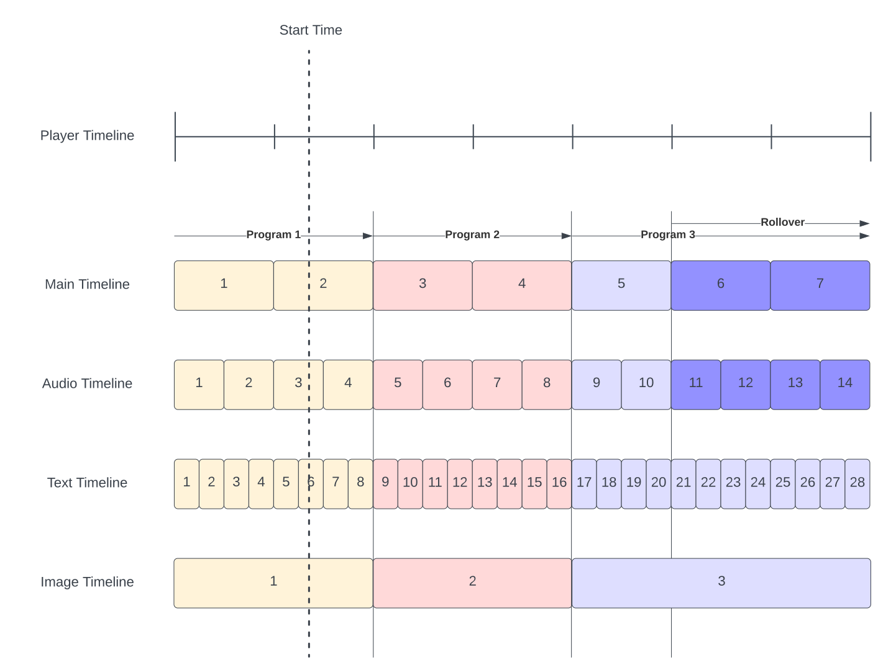
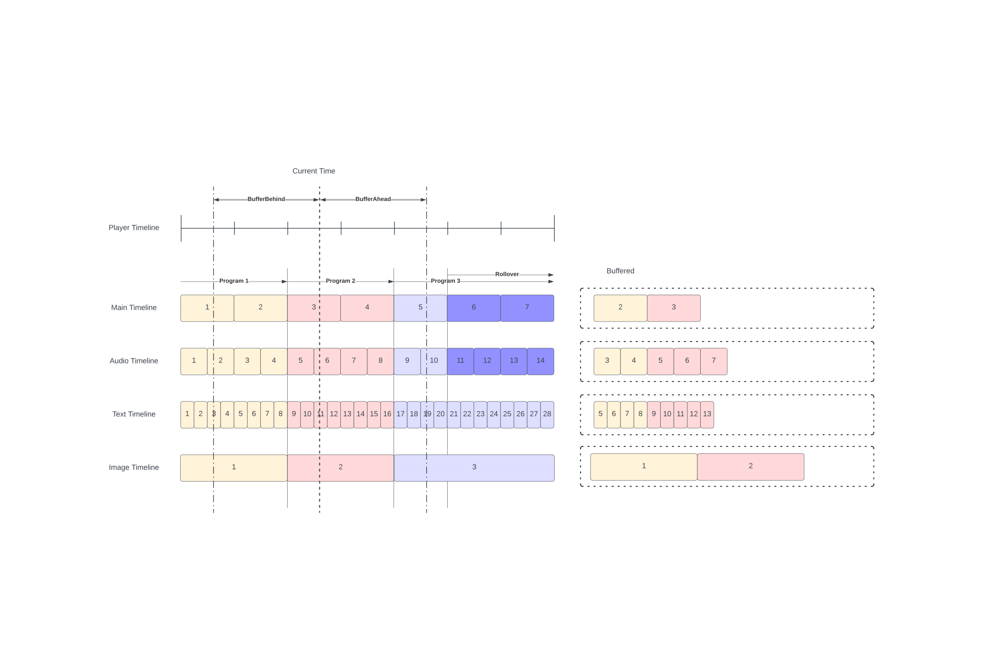
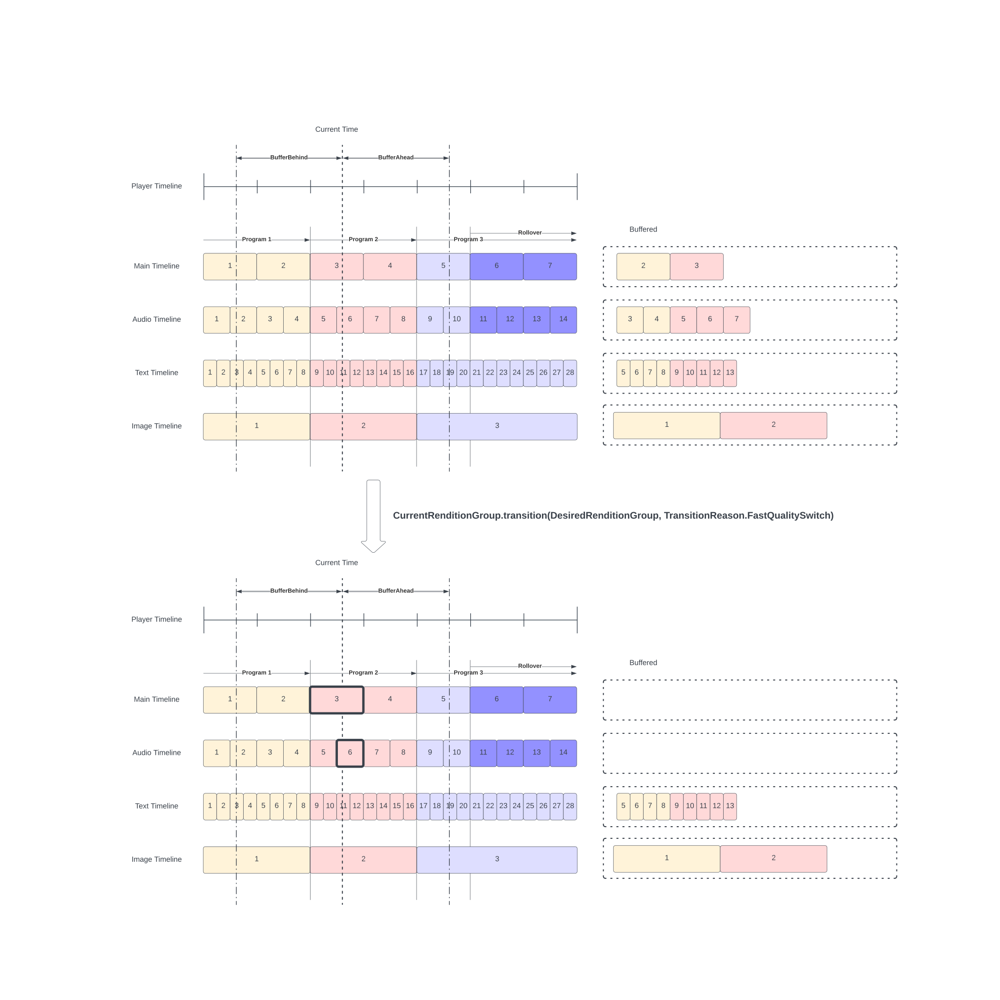
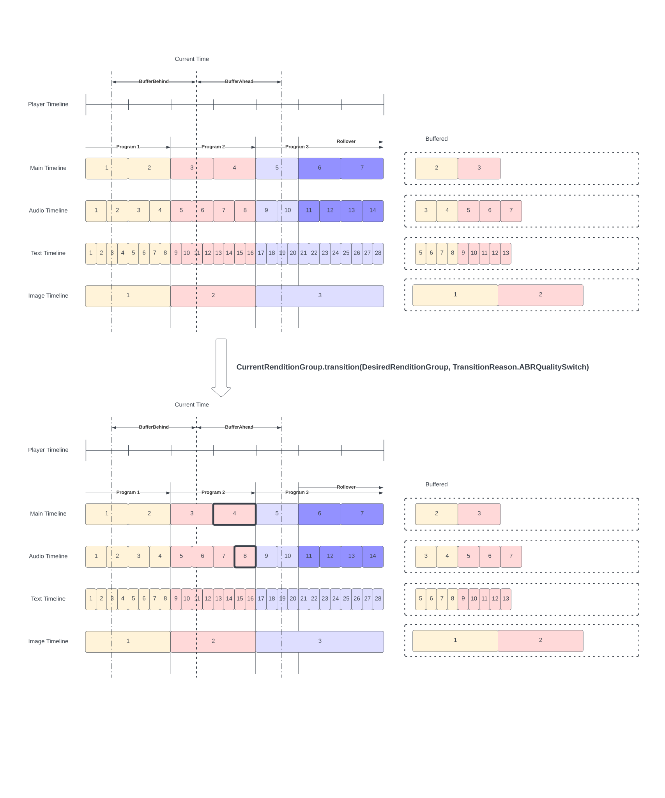

- Feature Name: VHS-Next
- Start Date: 2024-08-16
- PR: https://github.com/videojs/rfcs/pull/3

# Table of Content

* [Summary](#summary)
* [Motivation](#motivation)
    * [Maintenance Complexity](#maintenance-complexity)
    * [Troubleshooting Complexity](#troubleshooting-complexity)
    * [API limitations](#api-limitations)
* [Monorepo Structure](#monorepo-structure)
* [Functional Requirements](#functional-requirements)
* [Non-Functional Requirements and DX](#non-functional-requirements-and-dx)
  * [Browsers Matrix Support](#browsers-matrix-support)
* [Entities](#entities)
  * [Entities and their boundaries (high-level diagram)](#entities-and-their-boundaries-high-level-diagram)
  * [Player (Facade)](#player-facade)
  * [ServiceLocator](#servicelocator)
    * [Usage Example 1 (Access Service and use it)](#usage-example-1-access-service-and-use-it)
    * [Usage Example 2 (Build "your own player")](#usage-example-2-build-your-own-player)
    * [Usage Example 3 (Use your own services, customizations)](#usage-example-3-use-your-own-services-customizations)
    * [Usage Example 4 (Transfer State)](#usage-example-4-transfer-state)
  * [PipelineProvider](#pipelineprovider)
  * [AbrManager](#abrmanager)
  * [NetworkingManager](#networkingmanager)
  * [Events API](#events-api)
  * [Errors API](#errors-api)
* [Timing Models](#timing-models)
  * [HLS Timing model](#hls-timing-model)
    * [Applicable for each scenario](#applicable-for-each-scenario)
    * [Track alignments variations](#track-alignments-variations)
    * [Offset](#offset)
    * [Load](#load)
    * [Continuous loading within one rendition group](#continuous-loading-within-one-rendition-group)
    * [Manual Quality Switching](#manual-quality-switching)
    * [ABR Quality Switching](#abr-quality-switching)
  * [Dash Timing Model](#dash-timing-model)
* [References](#references)
    * [HLS Key Rotation](#hls-key-rotation)
    * [HLS Server Control](#hls-server-control)
    * [HLS Live Low Latency](#hls-live-low-latency)
    * [HLS Byte Range](#hls-byte-range)
    * [HLS In-Manifest Timed Metadata](#hls-in-manifest-timed-metadata)
    * [HLS MPEG-2 Transport Stream](#hls-mpeg-2-transport-stream)
    * [HLS Common Media Application Format](#hls-common-media-application-format)
    * [HLS Raw AAC](#hls-raw-aac)
    * [HLS Raw MP3](#hls-raw-mp3)
    * [HLS Raw AC3/EC3](#hls-raw-ac3ec3)
    * [HLS AES-128](#hls-aes-128)
    * [HLS ClearKey](#hls-clearkey)
    * [HLS WebVTT](#hls-webvtt)
    * [HLS IMSC](#hls-imsc)
    * [HLS Variable Substitution](#hls-variable-substitution)
    * [HLS Interstitial](#hls-interstitial)
    * [HLS Trick Play](#hls-trick-play)
    * [HLS In-manifest thumbnails i-frames](#hls-in-manifest-thumbnails-i-frames)
    * [HLS In-manifest thumbnails Roku](#hls-in-manifest-thumbnails-roku)
    * [HLS Session Data](#hls-session-data)
    * [DASH Indexed Addressing](#dash-indexed-addressing)
    * [DASH Explicit Addressing](#dash-explicit-addressing)
    * [DASH Simple Addressing](#dash-simple-addressing)
    * [DASH SegmentList](#dash-segmentlist)
    * [DASH Xlink](#dash-xlink)
    * [DASH Trick Play](#dash-trick-play)
    * [DASH In-manifest Timed Metadata](#dash-in-manifest-timed-metadata)
    * [DASH MPD Chaining](#dash-mpd-chaining)
    * [DASH Low Latency](#dash-low-latency)
    * [DASH In-manifest thumbnails](#dash-in-manifest-thumbnails)
    * [DRM](#drm)
    * [DRM Fairplay Legacy](#drm-fairplay-legacy)
    * [MPEG-2 TS AAC](#mpeg-2-ts-aac)
    * [MPEG-2 TS AC3/EC3](#mpeg-2-ts-ac3ec3)
    * [MPEG-2 TS MP3](#mpeg-2-ts-mp3)
    * [MPEG-2 TS Opus](#mpeg-2-ts-opus)
    * [MPEG-2 TS H264](#mpeg-2-ts-h264)
    * [MPEG-2 TS H265](#mpeg-2-ts-h265)
    * [MPEG-2 TS ID3](#mpeg-2-ts-id3)
    * [MPEG-2 TS CEA-608/CEA-708](#mpeg-2-ts-cea-608cea-708)
    * [MP4 CEA-608/CEA-708](#mp4-cea-608cea-708)
    * [MP4 IMSC](#mp4-imsc)
    * [MP4 VTT](#mp4-vtt)
    * [MP4 EMSG](#mp4-emsg)
    * [Offline](#offline)
    * [Content Steering](#content-steering)
    * [Common-Media-Client-Data](#common-media-client-data)
    * [Common-Media-Server-Data](#common-media-server-data)

# Summary

This document describes high-level requirements, API, and scenario examples for the VHS-Next (videojs playback engine) project.

This project is a pre-requisite for a massive `videojs-9` update.

# Motivation

The current playback engine (VHS and its ecosystem: `m3u8-parser`, `mpd-parser`, `mux.js`, `contrib-eme`, etc...) has reached a critical point where its issues significantly impede both maintenance and innovation.

These challenges have escalated the effort required to support and enhance the existing codebase.

Several key factors underscore the necessity for a new playback engine:

### Maintenance Complexity

Over time, its core architecture has revealed several fundamental limitations, which have manifested as frequent bugs and performance inefficiencies.

Fixing one issue often leads to the emergence of new problems, creating an unsustainable cycle of reactive maintenance.

### Troubleshooting Complexity

Unpredictable data flow made it increasingly difficult to troubleshoot the playback engine.

### API limitations

- The current playback engine is highly coupled with videojs and can't be used as a standalone player. There are many use cases where users want to build their own UI on top of the playback engine.
- The current playback engine does not provide a robust events API for monitoring and obtaining a clear data flow picture.
- The current playback engine does not provide a robust Errors API, making diagnosing and narrowing issues difficult.
- The current playback engine provides very limited interceptors API.
- The current playback engine provides very limited configuration API.

To address these (and many other) issues comprehensively, we propose the introduction of a new playback engine designed with modern principles and technologies.

This new engine will resolve the current deficiencies and provide a scalable foundation for future enhancements.

# Monorepo Structure

The `vhs-next` and future `videojs-9` related repositories should live in one `@videojs` scoped [monorepo](https://github.com/videojs/monorepo).

Here is monorepo structure example:

```
├── ...
├── packages
│   ├── ...
│   ├── transport-stream-parser (@videojs/transport-stream-parser)
│   ├── iso-bmff-parser         (@videojs/iso-bmff-parser)
│   ├── dash-parser             (@videojs/dash-parser)
│   ├── hls-parser              (@videojs/hls-parser)
│   ├── playback                (@videojs/playback)
│   ├── ui                      (@videojs/ui)
│   └── videojs.dev             (app, private: true)
├── package.json                (workspaces: [packages/*], private: true)
├── nx.json                     (shared NX configuration)
└── tsconfig.json               (shared TS configuration)

```

As you can see from this structure, videojs scoped monorepo will have 2 main repositories:

`@videojs/playback` is a standalone player that handles playback and does not support UI. (Similar to hls.js and dash.js).

`@videojs/ui` is a standalone UI player that uses `@videojs/playback` under the hood and provides a lot of UI WebComponents to customize your player. (Something similar to https://www.vidstack.io/ or https://www.media-chrome.org/)

This way we cover both groups of developers:
- Developers who want to build their own player's UI on top of `@videojs/playback`
- Developers who want embedded player experience

This document covers only `@videojs/playback` and other playback-related utility packages.

The following existing public packages should be deprecated and archived after `@videojs/playback` is fully developed:
- https://github.com/videojs/http-streaming
- https://github.com/videojs/videojs-contrib-eme
- https://github.com/videojs/vhs-utils
- https://github.com/videojs/m3u8-parser
- https://github.com/videojs/mux.js
- https://github.com/videojs/videojs-contrib-quality-levels
- https://github.com/videojs/mpd-parser
- https://github.com/videojs/aes-decrypter

# Functional Requirements

| Name                                                        | VHS (current) | Priority | Notes                                                                                                                                                                                                                            | References                                                                  |
|-------------------------------------------------------------|---------------|----------|----------------------------------------------------------------------------------------------------------------------------------------------------------------------------------------------------------------------------------|-----------------------------------------------------------------------------|
| **HLS**                                                     |               |          |                                                                                                                                                                                                                                  |                                                                             |
| HLS VOD Type                                                | ✅             | MUST     | N/A                                                                                                                                                                                                                              | N/A                                                                         |
| HLS Live Type                                               | ✅             | MUST     | N/A                                                                                                                                                                                                                              | N/A                                                                         |
| HLS Event Type                                              | ✅             | MUST     | N/A                                                                                                                                                                                                                              | N/A                                                                         |
| HLS Live DVR                                                | ✅             | MUST     | Must support proper `seekable` API.                                                                                                                                                                                              | N/A                                                                         |
| HLS Discontinuities                                         | ✅             | MUST     | We can use discontinuities to reset in-memory parsers (eg: transmuxers, cea-608/cea-708, etc...).                                                                                                                                | N/A                                                                         |
| HLS Alternative Audio (when main is muxed)                  | ❌             | MUST     | If alternative audio is enabled, in-segment audio should be ignored.                                                                                                                                                             | N/A                                                                         |
| HLS Standalone Media Playlist Loading                       | ✅             | MUST     | Player should support standalone media playlist load (outside of the multivariant playlist).                                                                                                                                     | N/A                                                                         |
| HLS Key Rotation                                            | ✅             | MUST     | Player should be able to rotate ext-x-keys (if multiple keys are presented in the playlist).                                                                                                                                     | [hls-key-rotation](#hls-key-rotation)                                       |
| HLS Server Control                                          | ✅             | MUST     | N/A                                                                                                                                                                                                                              | [hls-server-control](#hls-server-control)                                   |
| HLS Live Low Latency                                        | ✅             | MUST     | N/A                                                                                                                                                                                                                              | [hls-live-low-latency](#hls-live-low-latency)                               |
| HLS Byte Range                                              | ✅             | MUST     | N/A                                                                                                                                                                                                                              | [hls-byte-range](#hls-byte-range)                                           |
| HLS In-Manifest Timed Metadata                              | ✅             | MUST     | Both in-segment (id3 or emsg) and in-manifest (ext-x-DateRange) metadata will be processed.                                                                                                                                      | [hls-in-manifest-timed-metadata](#hls-in-manifest-timed-metadata)           |
| HLS MPEG-2 Transport Stream                                 | ✅             | MUST     | N/A                                                                                                                                                                                                                              | [hls-mpeg-2-transport-stream](#hls-mpeg-2-transport-stream)                 |
| HLS Common Media Application Format (CMAF)                  | ✅             | MUST     | N/A                                                                                                                                                                                                                              | [hls-common-media-application-format](#hls-common-media-application-format) |
| HLS Raw AAC                                                 | ✅             | MUST     | N/A                                                                                                                                                                                                                              | [hls-raw-aac](#hls-raw-aac)                                                 |
| HLS Raw MP3                                                 | ❌             | SHOULD   | N/A                                                                                                                                                                                                                              | [hls-raw-mp3](#hls-raw-mp3)                                                 |
| HLS Raw AC3/EC3                                             | ❌             | SHOULD   | N/A                                                                                                                                                                                                                              | [hls-raw-ac3/ec3](#hls-raw-ac3ec3)                                          |
| HLS WebVTT                                                  | ✅             | MUST     | timestamp sync is implemented via X-TIMESTAMP-MAP for raw or on a container level                                                                                                                                                | [hls-webVTT](#hls-webvtt)                                                   |
| HLS TTML                                                    | ❌             | MUST     | N/A                                                                                                                                                                                                                              | [hls-imsc](#hls-imsc)                                                       |
| HLS AES-128                                                 | ✅             | MUST     | The VHS implementation covers only AES-128 and creates an additional WebWorker per player instance. Shaka uses a native Web Crypto API. hls.js uses a combination of native Web Crypto and fallbacks to the software as decrypt. | [hls-aes-128](#hls-aes-128)                                                 |
| HLS SAMPLE-AES and SAMPLE-AES-CTR with KEYFORMAT="identity" | ❌             | COULD    | Key format "identity" is `ClearKey`. It is nice for testing EME flow, but does not provide an actual security.                                                                                                                   | [hls-clearKey](#hls-clearkey)                                               |
| HLS Variable Substitution                                   | ❌             | MUST     | N/A                                                                                                                                                                                                                              | [hls-variable-substitution](#hls-variable-substitution)                     |
| HLS Interstitial                                            | ❌             | COULD    | Content producers can insert separate interstitial content into their primary presentations in order to display advertising, branding, or other information to viewers. It is implemented via EXT-X-DATERANGE.                   | [hls-interstitial](#hls-interstitial)                                       |
| HLS Trick Play                                              | ❌             | SHOULD   | Trick play can be implemented via Ext-x-iframes-only playlists.                                                                                                                                                                  | [hls-trick-play](#hls-trick-play)                                           |
| HLS In-manifest thumbnails (ext-x-iframes-only)             | ❌             | SHOULD   | In-manifest support via Ext-x-iframes-only playlists with mjpg codec.                                                                                                                                                            | [hls-in-manifest-thumbnails-i-frames](#hls-in-manifest-thumbnails-i-frames) |
| HLS In-manifest thumbnails (roku)                           | ❌             | COULD    | N/A                                                                                                                                                                                                                              | [hls-in-manifest-thumbnails-roku](#hls-in-manifest-thumbnails-roku)         |
| HLS Session Data                                            | ❌             | SHOULD   | N/A                                                                                                                                                                                                                              | [hls-session-data](#hls-session-data)                                       |
| **DASH**                                                    |               |          |                                                                                                                                                                                                                                  |                                                                             |
| DASH VOD                                                    | ✅             | MUST     | N/A                                                                                                                                                                                                                              | N/A                                                                         |
| DASH Live                                                   | ✅             | MUST     | N/A                                                                                                                                                                                                                              | N/A                                                                         |
| DASH In-Progress Recording                                  | ✅             | MUST     | N/A                                                                                                                                                                                                                              | N/A                                                                         |
| DASH Live DVR (timeShiftBufferDepth)                        | ❌             | MUST     | Must support proper `seekable` API                                                                                                                                                                                               | N/A                                                                         |
| DASH Multi-Period                                           | ✅             | MUST     | We can use discontinuities to reset in-memory parsers (eg: transmuxers, cea-608/cea-708, etc...).                                                                                                                                | N/A                                                                         |
| DASH Xlink (onLoad)                                         | ❌             | SHOULD   | `onLoad`: an application should dereference the remote element entity immediately on loading the MPD.                                                                                                                            | [dash-xlink](#dash-xlink)                                                   |
| DASH Xlink (onRequest)                                      | ❌             | COULD    | `onRequest` (default): according to W3C Xlink, an application should dereference the remote element entity only on a post-loading event triggered for the purpose of dereferencing.                                              | [dash-xlink](#dash-xlink)                                                   |
| DASH Segment Index Addressing                               | ✅             | MUST     | SegmentBase                                                                                                                                                                                                                      | [dash-indexed-addressing](#dash-indexed-addressing)                         |
| DASH Segment Explicit Addressing                            | ✅             | MUST     | SegmentTemplate with SegmentTimeline                                                                                                                                                                                             | [dash-explicit-addressing](#dash-explicit-addressing)                       |
| DASH Segment Simple Addressing                              | ✅             | MUST     | SegmentTemplate without SegmentTimeline                                                                                                                                                                                          | [dash-simple-addressing](#dash-simple-addressing)                           |
| DASH Segment SegmentList Addressing                         | ✅             | MUST     | N/A                                                                                                                                                                                                                              | [dash-segmentList](#dash-segmentlist)                                       |
| DASH In-manifest timed Metadata                             | ✅             | MUST     | via EventStream                                                                                                                                                                                                                  | [dash-in-manifest-timed-metadata](#dash-in-manifest-timed-metadata)         |
| DASH MPD-Chaining                                           | ❌             | COULD    | MPD chaining provides a mechanism to indicate that, at the end of one Media Presentation, a new Media Presentation starts.                                                                                                       | [dash-mpd-chaining](#dash-mpd-chaining)                                     |
| DASH Low Latency                                            | ❌             | SHOULD   | N/A                                                                                                                                                                                                                              | [dash-low-latency](#dash-low-latency)                                       |
| DASH Trick Play                                             | ❌             | SHOULD   | N/A                                                                                                                                                                                                                              | [dash-trick-play](#dash-trick-play)                                         |
| DASH In-manifest thumbnails                                 | ❌             | SHOULD   | N/A                                                                                                                                                                                                                              | [dash-in-manifest-thumbnails](#dash-in-manifest-thumbnails)                 |
| **DRM**                                                     |               |          |                                                                                                                                                                                                                                  |                                                                             |
| Widevine                                                    | ✅             | MUST     | N/A                                                                                                                                                                                                                              | [drm](#drm)                                                                 |
| PlayReady                                                   | ✅             | MUST     | N/A                                                                                                                                                                                                                              | [drm](#drm)                                                                 |
| Fairplay                                                    | ✅             | MUST     | N/A                                                                                                                                                                                                                              | [drm](#drm) <br/> [drm-fairplay-legacy](#drm-fairplay-legacy)               |
| ClearKey                                                    | ❌             | COULD    | See HLS and DASH sections about ClearKey.                                                                                                                                                                                        | [drm](#drm)                                                                 |
| **Containers**                                              |               |          |                                                                                                                                                                                                                                  |                                                                             |
| MPEG-2 TS AAC (Audio Codec)                                 | ✅             | MUST     | Transmux to AAC in MP4                                                                                                                                                                                                           | [mpeg-2-ts-aac](#mpeg-2-ts-aac)                                             |
| MPEG-2 TS AC/EC3 (Audio Codec)                              | ❌             | SHOULD   | Transmux to AC/EC3 in MP4                                                                                                                                                                                                        | [mpeg-2-ts-ac3/ec3](#mpeg-2-ts-ac3ec3)                                      |
| MPEG-2 TS MP3 (Audio Codec)                                 | ❌             | SHOULD   | Transmux to MP3 in MP4                                                                                                                                                                                                           | [mpeg-2-ts-mp3](#mpeg-2-ts-mp3)                                             |
| MPEG-2 TS Opus (Audio Codec)                                | ❌             | SHOULD   | Transmux to Opus in MP4                                                                                                                                                                                                          | [mpeg-2-ts-opus](#mpeg-2-ts-opus)                                           |
| MPEG-2 TS H264 (Video Codec)                                | ✅             | MUST     | Transmux to H264 in MP4                                                                                                                                                                                                          | [mpeg-2-ts-h264](#mpeg-2-ts-h264)                                           |
| MPEG-2 TS H265 (Video Codec)                                | ❌             | MUST     | Transmux to H265 in MP4                                                                                                                                                                                                          | [mpeg-2-ts-h265](#mpeg-2-ts-h265)                                           |
| MPEG-2 TS ID3 (timed metadata)                              | ✅             | MUST     | N/A                                                                                                                                                                                                                              | [mpeg-2-ts-id3](#mpeg-2-ts-id3)                                             |
| MPEG-2 TS CEA-608/CEA-708 (text tracks)                     | ✅             | MUST     | N/A                                                                                                                                                                                                                              | [mpeg-2-ts-cea-608/cea-708](#mpeg-2-ts-cea-608cea-708)                      |
| MP4 CEA-608/CEA-708 (text tracks)                           | ✅             | MUST     | N/A                                                                                                                                                                                                                              | [mp4-cea-608/cea-708](#mp4-cea-608cea-708)                                  |
| MP4 IMSC (text-tracks)                                      | ❌             | MUST     | N/A                                                                                                                                                                                                                              | [mp4-imsc](#mp4-imsc)                                                       |
| MP4 VTT (text-tracks)                                       | ❌             | MUST     | N/A                                                                                                                                                                                                                              | [mp4-vtt](#mp4-vtt)                                                         |
| MP4 EMSG (timed-metadata)                                   | ✅             | MUST     | N/A                                                                                                                                                                                                                              | [mp4-emsg](#mp4-emsg)                                                       |
| **Server-Client Signaling**                                 |               |          |                                                                                                                                                                                                                                  |                                                                             |
| Content Steering                                            | ✅             | MUST     | N/A                                                                                                                                                                                                                              | [content-steering](#content-steering)                                       |
| Common-Media-Client-Data (CMCD)                             | ❌             | SHOULD   | We may consider re-using `@svta/common-media-library/cmcd/*` utils                                                                                                                                                               | [common-media-client-data](#common-media-client-data)                       |
| Common-Media-Server-Data (CMSD)                             | ❌             | SHOULD   | Mainly for ABR. We may consider re-using `@svta/common-media-library/cmsd/*` utils                                                                                                                                               | [common-media-server-data](#common-media-server-data)                       |
| **Offline**                                                 |               |          |                                                                                                                                                                                                                                  |                                                                             |
| IndexDB VOD persistence                                     | ❌             | SHOULD   | N/A                                                                                                                                                                                                                              | [offline](#offline)                                                         |
| Offline DRM                                                 | ❌             | SHOULD   | N/A                                                                                                                                                                                                                              | [offline](#offline)                                                         |

# Non-Functional Requirements and DX

| Name                                        | VHS (current) | Priority | Notes                                                                                                                                                                                                                                                                                                                                                |
|---------------------------------------------|---------------|----------|------------------------------------------------------------------------------------------------------------------------------------------------------------------------------------------------------------------------------------------------------------------------------------------------------------------------------------------------------|
| Events API                                  | ✅             | MUST     | The current VHS implementation provides a very limited Events System. The player must provide a predictable and robust set of events with extensive event data.                                                                                                                                                                                      |
| Errors API                                  | ✅             | MUST     | The current VHS implementation provides a very limited Error System. The player must provide a predictable and robust set of errors with extensive error data. Each error must have category, code, and severity information alongside error data (if any).                                                                                          |
| Configurations API                          | ✅             | MUST     | The current VHS implementation provides a very limited Configuration API. Users should be able to configure different aspects of the player's workflow during runtime (where possible).                                                                                                                                                              |
| Env Capabilities API                        | ❌             | MUST     | The player must provide probe env capabilities API                                                                                                                                                                                                                                                                                                   |
| Debug API                                   | ✅             | MUST     | The player must provide debug-related APIs (eg: logger levels)                                                                                                                                                                                                                                                                                       |
| ABR Strategies API                          | ❌             | MUST     | The current VHS implementation provides a very limited ABR System. dash.js has an excellent example of ABR Strategies API.                                                                                                                                                                                                                           |
| Stream API                                  | ❌             | MUST     | The player should be able to utilize browser's fetch Readable/Writable Streams API and continuously process chunks of data instead of waiting while a whole resource is loaded.                                                                                                                                                                      |
| Managed Media Source API                    | ❌             | MUST     | https://www.w3.org/TR/media-source-2/#managedmediasource-interface currently available only in Safari (mac, ios, ipados) 17+                                                                                                                                                                                                                         |
| MSE in workers                              | ❌             | COULD    | https://wolenetz.github.io/mse-in-workers-demo/mse-in-workers-demo.html https://webkit.org/blog/15260/release-notes-for-safari-technology-preview-192 both chrome and safari already have support                                                                                                                                                    |
| Interceptors API                            | ❌             | MUST     | In contrast to Events API, where the player notifies clients, Interceptors API allows users to intercept and modify data during important processing steps (including network requests).                                                                                                                                                             |
| Networking API                              | ❌             | MUST     | Users should be able to configure player networking behavior for **specific request type**: `maxAttempts`, `initialDelay`, `delayFactor`, `fuzzFactor` and `timeout`                                                                                                                                                                                 |
| Service Locator API                         | ❌             | MUST     | Users should be able to replace ANY service managed by ServiceLocator based on their needs (including "during player runtime"). Users must implement interfaces for the services they want to replace or use service implementations provided by us. This API offers a "build your own player" feature and allows extremely flexible customizations. |
| Size: Opt-in features as separate bundles   | ❌             | MUST     | Most features should be provided via separate bundles and not included in the main player bundle by default.                                                                                                                                                                                                                                         |
| Size: Popular bundle presets                | ❌             | MUST     | While users can create their own player using Service Locator API, we should provide popular features bundle presets. eg: (player + hls pipeline) or (player + dash pipeline) or (player + hls and dash pipelines), etc..                                                                                                                            |
| CLI prompt player builder                   | ❌             | SHOULD   | If users want to build a player with a very custom set of features or don't know exactly what features should be included, they can use the CLI prompt-based tool.                                                                                                                                                                                   |
| Demo page with timeline visualization       | ❌             | COULD    | hls.js has an excellent example of timeline visualization on its demo page.                                                                                                                                                                                                                                                                          |
| Live Range Recorder with Server Replay Tool | ❌             | COULD    | Tool to record a problematic part from a live stream and replay it (in VOD or LIVE modes)                                                                                                                                                                                                                                                            |
| Generated API reference                     | ❌             | MUST     | N/A                                                                                                                                                                                                                                                                                                                                                  |
| Tutorials Documentation                     | ✅             | MUST     | N/A                                                                                                                                                                                                                                                                                                                                                  |
| Contributors Guides                         | ✅             | MUST     | N/A                                                                                                                                                                                                                                                                                                                                                  |
| Generate Changelog                          | ✅             | MUST     | N/A                                                                                                                                                                                                                                                                                                                                                  |
| Public Roadmap                              | ❌             | SHOULD   | N/A                                                                                                                                                                                                                                                                                                                                                  |

## Browsers Matrix Support

|                     | Windows      | MacOS          | Linux        | Android      | iOS            | iPadOS         | Other                               |
|---------------------|--------------|----------------|--------------|--------------|----------------|----------------|-------------------------------------|
| Chrome              | >= 76 (2021) | >= 76 (2021)   | >= 76 (2021) | >= 76 (2021) | >= 76 (2021)   | >= 76 (2021)   | N/A                                 |
| Firefox             | >= 85 (2021) | >= 85 (2021)   | >= 85 (2021) | >= 85 (2021) | >= 85 (2021)   | >= 85 (2021)   | N/A                                 |
| Edge (Chromium)     | >= 76 (2021) | >= 76 (2021)   | >= 76 (2021) | >= 76 (2021) | >= 76 (2021)   | >= 76 (2021)   | N/A                                 |
| Safari              | N/A          | >= 15.x (2021) | N/A          | N/A          | >= 15.x (2021) | >= 15.x (2021) | N/A                                 |
| Tizen (Chromium)    | N/A          | N/A            | N/A          | N/A          | N/A            | N/A            | >= Tizen 6.x (2021, Chromium 76)    |
| WebOS TV (Chromium) | N/A          | N/A            | N/A          | N/A          | N/A            | N/A            | >= WebOS TV 6.x (2021, Chromium 79) |

> [!IMPORTANT]
>
> iOS < 17.1 does not support MSE, so only native playback is supported. iOS >= 17.1 supports MMSE (managed MSE)
>
> IPadOS < 17.0 does not support MSE, so only native playback is supported. IPadOS >= 17.0 supports MMSE (managed MSE)

# Entities

This section describes entities, their relationship, and boundaries with possible API examples.

> [!WARNING]
>
> Entities APIs/Names/boundaries outlined in this document are not final.
>
> Not all methods/getters/setters/enums/consts are listed for a given entity.
>
> Some entities could represent a group of low-level entities.
>
> This is just an example to provide an overall idea.

## Entities and their boundaries (high-level diagram)



## Player (Facade)

The player facade is the main API gateway for almost all features our playback engine provides. Its primary purpose is to simplify client usage and hide complexity.

```ts
type EventHandler<T> = (event: T) => void;

type Interceptor<T> = (payload: T) => T;

type AsyncInterceptor<T> = (payload: T) => Promise<T>;

interface KeySystemConfig {
  licenseServerUri: string;
  serverCertificateUri?: string;
  serverCertificate?: Uint8Array;
  persistentState?: MediaKeysRequirement;
  distinctiveIdentifier?: MediaKeysRequirement;
  videoRobustness?: string;
  audioRobustness?: string;
  sessionType?: MediaKeySessionType;
  getContentId?: (contentId: string) => string;
}

type SourceKeySystems = Record<string, KeySystemConfig>;

interface Source {
  mimeType: string;
  url: string;
  keySystems?: SourceKeySystems;
}

interface Player {
  // Version API

  // get current player's version
  getVersion(): string;
  // get current player's version hash
  getVersionHash(): string;

  // Service Locator API
  
  getServiceLocator(): ServiceLocator;

  // Configuration API

  // get deep copy of the current configuration
  getConfigurationSnapshot(): PlayerConfiguration;
  // update current configuration
  updateConfiguration(configurationChunk: DeepPartial<PlayerConfiguration>): void;
  // reset configuration to default
  resetConfiguration(): void;
  
  // Debug API
  
  // get current logger level
  getLoggerLevel(): LoggerLevel;
  // set logger level
  setLoggerLevel(loggerLevel: LoggerLevel): void;

  // Life Cycle API
  
  // attach player to the video element that has already been defined in the DOM
  attach(videoElement: HTMLVideoElement): void;
  // get current video element
  getCurrentVideoElement(): HTMLVideoElement | null;
  // detach player from the current video element
  detach(): void;
  // stop current playback and transition to idle state
  stop(): void;
  // cleanup all services and destroy player itself
  destroy(): void;
  // load provided source, create processing pipeline based on mime type and transition to loading state
  load(source: Source): void;
  // get active source
  getCurrentSource(): Source | null;
  
  // Playback API
  
  // initiate / continue playback --> forward call to pipeline
  play(): void;
  // pause current playback --> forward call to pipeline
  pause(): void;
  // seek to the seek target, should return false if seek target is out of any seekable ranges
  seek(seekTarget: number): boolean;
  // get current time
  getCurrentTime(): number;
  // get current playback rate
  getPlaybackRate(): number;
  // set current playback rate
  setPlaybackRate(rate: number): void;
  // mute current playback
  mute(): void;
  // unmute current playback
  unmute(): void;
  // get current volume level
  getVolumeLevel(): number;
  // set current volume level (clamp [0-1])
  setVolumeLevel(level: number): void;
  // get current playback duration (from the pipeline)
  getDuration(): number;
  // get current player state
  getCurrentPlayerState(): PlayerState;
  // get muted state
  getIsMuted(): boolean;
  // get snapshot of the buffered ranges from the current pipeline
  getBufferedRanges(): Array<PlayerTimeRange>;
  // get active buffered range
  getActiveBufferedRange(): PlayerTimeRange | null;
  // get snapshot of the seekable ranges from the current pipeline
  getSeekableRanges(): Array<SeekableRange>;
  
  // Playback API: Audio Tracks
  
  // get snapshot of the audio tracks from the current pipeline
  getAudioTracks(): Array<AudioTrack>;
  // get currently active audio track
  getActiveAudioTrack(): AudioTrack | null;
  // select audio track --> forward call to pipeline
  selectAudioTrack(audioTrack: AudioTrack): void;

  // Playback API: Text Tracks

  // get text tracks from the current pipeline
  getTextTracks(): Array<TextTrack>;
  // get active text track
  getActiveTextTrack(): TextTrack | null;
  // select text track --> forward call to pipeline
  selectTextTrack(track: TextTrack): void;
  // add remote vtt text track (only VOD), should return false for live --> forward call to pipeline
  addRemoteTextTrack(remoteTextTrackOptions: RemoteTextTrackOptions): boolean;
  // remove remote vtt text track (only VOD), should return false for live --> forward call to pipeline
  removeRemoteTextTrack(textTrack: TextTrack): boolean;

  // Playback API: Thumbnails Tracks

  // get thumbnails tracks from the current pipeline
  getThumbnailTracks(): Array<ThumbnailTrack>;
  // get active thumbnail track
  getActiveThumbnailTrack(): ThumbnailTrack | null;
  // select thumbnails track --> forward call to pipeline
  selectThumbnailTrack(thumbnailTrack: ThumbnailTrack): void;
  // add remote vtt thumbnail track (only VOD), should return false for live --> forward call to pipeline
  addRemoteThumbnailTrack(remoteThumbnailTrackOptions: RemoteThumbnailTrackOptions): boolean;
  // remove remote vtt thumbnail track (only VOD), should return false for live --> forward call to pipeline
  removeRemoteThumbnailTrack(thumbnailTrack: ThumbnailTrack): boolean;

  // Playback API: Metadata Tracks
  // get metadata tracks from the current pipeline (in-manifest timed-metadata, in-segment timed metadata)
  getMetadataTrack(): MetadataTrack;

  // Playback API: Quality Levels
  
  // get all quality levels available for main track (video+audio, video-only, audio-only)
  getQualityLevels(): Array<QualityLevel>;
  // get current active quality level
  getActiveQualityLevel(): QualityLevel | null;
  // select active quality level --> this will disable ABR
  selectQualityLevel(level: QualityLevel): void;
  // enable ABR
  selectAutoQualityLevel(): void;

  // Events API
  // Errors API is available via PlayerErrorEvent

  // register event handler for specific event
  addEventListener<K extends PlayerEventType>(eventType: K, eventHandler: EventHandler<EventTypeToEventMap[K]>): void;
  // register event handler for all events '*', mainly for debug purposes
  addEventListenerForAllEvents(eventHandler: EventHandler<PlayerEvent>): void;
  // register event handler for specific events once
  once<K extends PlayerEventType>(eventType: K, eventHandler: EventHandler<EventTypeToEventMap[K]>): void;
  // remove specific registered event handler for specific event
  removeEventListener<K extends PlayerEventType>(eventType: K, eventHandler: EventHandler<EventTypeToEventMap[K]>): void;
  // remove all registered event handlers for specific event
  removeAllEventListenersForType<K extends PlayerEventType>(eventType: K): void;
  // remove all registered event handlers for all events
  removeAllEventListeners(): void;

  // Interceptors API

  // register interceptor for a specific player's processing step. (sync)
  addInterceptor<K extends InterceptorType>(interceptorType: K, interceptor: Interceptor<InterceptorTypeToPayloadMap[K]>): void;
  // register interceptor for a specific player's processing step. (async, some steps can be processed as async, so we should have a separate api)
  addAsyncInterceptor<K extends AsyncInterceptorType>(interceptorType: K, interceptor: AsyncInterceptor<AsyncInterceptorTypeToPayloadMap[K]>): void;
  // remove specific interceptor for specific step (sync)
  removeInterceptor<K extends InterceptorType>(interceptorType: K, interceptor: Interceptor<InterceptorTypeToPayloadMap[K]>): void;
  // remove specific interceptor for specific step (async)
  removeAsyncInterceptor<K extends AsyncInterceptorType>(interceptorType: K, interceptor: AsyncInterceptor<AsyncInterceptorTypeToPayloadMap[K]>): void;
  // remove all interceptors
  removeAllInterceptors(): void;

  // Networking API

  // update networking configuration for specific request type
  updateNetworkingConfiguration(requestType: NetworkRequestType, networkingConfiguration: NetworkingConfiguration): void;
  // reset networking configuration to default values for specific request type
  resetNetworkingConfiguration(requestType: NetworkRequestType): void;
  // reset networking configurations for all reques types
  resetAllNetworkingConfigurations(): void;
  
  // Env capabilities API
  
  // probe current env capabilities
  probeEnvCapabilities(): Promise<CapabilitiesProbeResult>
}
```

## ServiceLocator

ServiceLocator is the main entity that locates and updates services.

By default, the player should have limited functionality and support only native playback. ServiceLocator is initialized with fallback services.

ServiceLocator provides three main features:

Build "your own player". (Replace default fallbacks with implementations provided by us)
Customize ANY service. (Replace default fallbacks or implementations provided by us with your own implementations)
Access to ANY service. (ServiceLocator allows access to any available service)


### Usage Example 1 (Access Service and use it)

```ts
import { Player } from '@videojs/playback';

const player = new Player();
const serviceLocator = player.getServiceLocator();
const hlsParser = serviceLocator.getHlsParser();

hlsParser.parse(playlist);
```

### Usage Example 2 (Build "your own player")

```ts
import { HlsParser } from '@videojs/hls-parser';
import { Player } from '@videojs/playback';
import { HlsPipeline } from '@videojs/playback/pipelines/mse/hls';

const player = new Player();
const serviceLocator = player.getServiceLocator();
const pipelineProvider = serviceLocator.getPipelineProvider();
const hlsPipeline = new HlsPipeline({ serviceLocator });
const hlsParser = new HlsParser({ serviceLocator });
serviceLocator.replaceHlsParser(hlsParser);

pipelineProvider.addPipeline(Player.MimeType.HLS_VND_APPLE_MPEG_URL, hlsPipeline);
pipelineProvider.addPipeline(Player.MimeType.HLS_X_MPEG_URL, hlsPipeline);
```

### Usage Example 3 (Use your own services, customizations)

```ts
import { YourHlsParser, YourHlsPipeline } from 'your-app';
import { Player } from '@videojs/playback';

// NOTE: 
// YourHlsParser or YourHlsPipeline (or any other services) 
// could be extensions from our implementations 
// or completely independent implementations (It should not necessarily be a class. it could be an object with properties.)
// It does not matter.
// All we care about is that the provided implementation conforms with the expected interface.

const player = new Player();
const serviceLocator = player.getServiceLocator();
const pipelineProvider = serviceLocator.getPipelineProvider();
// you can use serviceLocator or dont use it, or any other dependencies, whatever your implementation looks like
const hlsPipeline = new YourHlsPipeline({ serviceLocator, ...anyOtherDependencies });
// you can use serviceLocator or dont use it, or any other dependencies, whatever your implementation looks like
const hlsParser = new YourHlsParser({ serviceLocator, ...anyOtherDependencies });
// NOTE: YourHlsParser must implement required interface to be able to set it
serviceLocator.replaceHlsParser(hlsParser);
// NOTE: YourHlsPipeline must implement required interface to be able to set it
pipelineProvider.addPipeline(Player.MimeType.HLS_VND_APPLE_MPEG_URL, hlsPipeline);
// NOTE: YourHlsPipeline must implement required interface to be able to set it
pipelineProvider.addPipeline(Player.MimeType.HLS_X_MPEG_URL, hlsPipeline);
```

### Usage Example 4 (Transfer State)

```ts
import { YourHlsParser } from 'your-app';

//...

const player = new Player();
const serviceLocator = player.getServiceLocator();
const currentHlsParser = serviceLocator.getHlsParser();

const currentHlsParserState = currentHlsParser.getTransferableState();
// you can use this state:
const newHlsParser = new YourHlsParser({ serviceLocator, ...currentHlsParserState, ...anyOtherDependencies })

//...
```


```ts
// Service Locator API

interface Service<T, C> {
  // Generate internal state snapshot as transferable object. Users can use this method if they want to replace service during runtime.
  getTransferableState(): T;
  // Player will forward update configuration call to service locator, and service locator will forward to all service. Services can react on configuration changes.
  updateConfiguration(configurationChunk: DeepPartial<C>): void;
  // Player will forward attach call to service locator, and service locator will forward to all services. Services can listent to event from video element.
  attach(videoElement: HTMLVideoElement): void;
  // Player will forward detach call to service locator, and service locator will forward to all services. Services can cleanup events from video element.
  detach(): void;
  // Player will forward detroy call to service locator, and service locator will forward to all services. Services can cleanup all events, timers, state, etc...
  destroy(): void;
}

interface ServiceLocator {
  // Each service should have 2 possible methods within service locator: get, replace. Examples:
  
  // ...
  
  getPipelineProvider(): PipelineProvider;
  
  replacePipelineProvider(provider: PiplineProvider): void;
  
  getHlsParser(): HlsParser;
  
  replaceHlsParser(parser: HlsParser): void;
  
  getDashParser(): DashParser;
  
  replaceDashParser(parser: DashParser): void;
  
  getNetworkingManager(): NetworkingManager;
  
  replaceNetworkingManager(networkingManager: NetworkingManager): void;
  
  getAbrManager(): AbrManager;
  
  replaceAbrManager()

  // ...
}

```

## PipelineProvider

The pipeline provider allows custom pipelines to be registered for specific mimeTypes. The player will use it during load.

```ts
interface PipelineProvider {
  // Add or replace pipeline for specific mime type, added pipeline will be called during "load" for a given mimeType
  addPipeline(mimeType: string, pipeline: Pipeline): void;
  // Remove pipeline for a specific mimeType
  removePipeline(mimeType: string, pipeline: Pipeline): void;
  // get pipeline for a given mimeType
  getPipelineFor(mimeType: string): Pipeline | null;
}
```

## AbrManager

AbrManager should control adaptation sets switching based on the registered ABR rules.

We should provide the default EWMA rule.

```ts
interface AbrManager {
  // add abr rule
  addAbrRule(rule: AbrRule): void;
  // remove abr rule
  removeAbrRule(rule: AbrRule): void;
  // get all registered rules
  getRules(): Array<AbrRule>;
}
```

## NetworkingManager

NetworkingManager is a high-level abstraction over the browser's fetch or XHR API.
- Should support Streams API to stream chunks of data from the network. (where possible)
- Should execute interceptors for `InterceptorType.NetworkRequestStart` to modify request payload, `InterceptorType.NetworkRequestComplete` to modify response payload, `InterceptorType.NetworkRequestFailed` to modify failed response payload.
- Should trigger `Event.NetworkRequestStart`, `Event.NetworkRequestComplete`, `Event.NetworkRequestFailed` events with corresponding event payloads.

```ts

enum NetworkRequestType {
  HlsMasterPlaylist,
  HlsMediaPlaylist,
  DashManifest,
  ContentSteering,
  License,
  key,
  InitSegment,
  MediaSegment
}

// Example of the networking configuration per network request type

interface NetworkingConfiguration {
  /**
   * The maximum number of requests before we fail.
   * Defaults to `1`
   */
  maxAttempts: number;

  /**
   * The base delay in ms between retries.
   * Defaults to `1_000`
   */
  initialDelay: number;

  /**
   * Increase delay for each retry: delay += (delay * delayFactor).
   * Defaults to `0.2`
   */
  delayFactor: number;

  /**
   * Do not send retry requests in the exact same timing, but rather fuzz it by some range, eg: if the delay = 3000, and fuzz factor is 0.1,
   * then the requests will be made somewhere in the following time range range: [2700, 3300].
   * Defaults to `0.2`
   */
  fuzzFactor: number;

  /**
   * The timeout in ms, after which we abort.
   * Defaults to `20_000`
   */
  timeout: number;
}

```

## Events API

```ts
// Events API

// Note: not all events are listed, it is just an example

enum PlayerEventType {
  Error = 'Error'
};

// mapping for types purposes
interface EventTypeToEventMap {
  [PlayerEventType.Error]: PlayerErrorEvent;
}

abstract class PlayerEvent {
  public abstract readonly type: PlayerEventType;
}


class PlayerErrorEvent extends PlayerEvent {
  type = PlayerEventType.Error;
  error: PlayerError;

  constructor(playerError: PlayerError) {
    super();
    this.error = playerError;
  }
}
```

## Errors API

```ts
// Errors API

// Note: not all events are listed, it is just an example

enum ErrorCategory {
  Hls = 1,
}

enum ErrorCode {
  FailedToParseHlsPlaylist = 1000,
}

abstract class PlayerError {
  public abstract readonly category: ErrorCategory;
  public abstract readonly code: ErrorCode;
  public abstract readonly isFatal: boolean;
}

abstract class HlsPlayerError extends PlayerError {
  category = ErrorCategory.Hls;
}

class FailedToParseHlsPlaylistPlayerError extends HlsPlayerError {
  code = ErrorCode.FailedToParseHlsPlaylist;
  public readonly reason: string;

  constructor(reason: string, isFatal: boolean) {
    super();
    this.reason = reason;
    this.isFatal = isFatal;
  }
}
```

```ts
// Interceptors API

// Note: not all interceptors types are listed, it is just an example

enum InterpceptorType {
  NetworkRequestStart = 'NetworkRequestStart'
}

enum AsyncInterceptorType {
  NetworkRequestStart = 'NetworkRequestStart'
}

interface InterceptorTypeToPayloadMap {
  [InterpceptorType.NetworkRequestStart]: NetworkRequest
}

interface AsyncInterceptorTypeToPayloadMap {
  [InterpceptorType.NetworkRequestStart]: NetworkRequest
}
```

# Timing Models

## HLS Timing model

### Applicable for each scenario

- We should always demux the main with audio and video. This will help us switch alternative audio without reloading the whole video part.
- We should always override original timestamps according to the player's timeline. This should significantly simplify time calculations and reduce sync issues and gaps jumping.
- We should always use an index-based approach when continuously loading segments within one rendition group. We should align timestamps based on sourceBuffer.buffered time ranges to avoid gaps.


### Track alignments variations

It may be that for various content processing workflow reasons, some tracks have a different duration from others. For example, the audio track might start a fraction of a second before the video track and end some time before the video track end and so on, here are several example:



> [!NOTE]
> 
> Content may be padded (optionally) to equalize track lengths.
> 
> If you wish to preserve track contents in their entirety, the most interoperable option is to add padding samples (e.g. silence or black frames)
> 
> but since the padding must match the codec configuration of the real content, it can be hard to implement on player's side.
> 
> However, users might know better about their content, so we can provide API to provide us with required paddings (if necessary), eg:
> 
> player.addInterceptor(InterceptorType.ContentPrePadding, ({ codec, prePaddingData }) => { ...return prePaddingData })
> player.addInterceptor(InterceptorType.ContentPostPadding, ({ codec, postPaddingData }) => { ...return postPaddingData })

### Offset

```js
// get initial offset:
offset = min(audioTrack.startPts, videoTrack.startPts) / timescale

// aligne timestamps with zero-point:

audioTrack.samples.forEach((sample) => {
  sample.pts -= offset;
});

videoTrak.samples.forEach((sample) => {
  sample.pts -= offset;
});
```

### Load

The `Player Timeline` is built based on the first `main` occurrence. This timeline should reflect what users see on the player's UI.

`Start Time`:
- VOD: is the value provided by the client during load (default value is `0` for VOD)
- LIVE: hold-back value from the server control or 3 * target duration

The `Main Timeline` reflects the `main` playlist (ext-x-stream-inf, which could be `video+audio`, `video-only`, or `audio-only`).

`Audio Timeline` reflects alternative audio playlist (ext-x-media, type="audio") or demuxed audio from `main`.

`Text Timeline` reflects subtitles playlist (ext-x-media, type="subtitles"") or closed-captions (cea-608/708).

`Image Timeline` reflects the image playlist (ext-x-image-stream-inf) or (ext-x-iframe-stream-inf)

Once a user loads a source, we group renditions into Rendition Groups and select the appropriate rendition group by initial bandwidth. Once the main media playlist is loaded, we should create a `PlayerTimeline`. We should select the first segments to load based on `Start Time` and update the `index`.



### Continuous loading within one rendition group

`BufferBehind` is a configurable value in seconds to keep in the buffer behind the playhead. Everything else will be removed from the buffer.

`BufferAhead` is a configurable value in seconds to buffer ahead of the play head. (buffer goal).

In the following example, we continuously load segments within one rendition group.
- We select the next segment using the `++index` approach.
- We should align timestamps based on sourceBuffer.buffered time ranges to avoid gaps.

So, In this particular example:

`MainTimeline` buffered segments 2 and 3. Both are covered with `BufferBehind,` so there is no segment to remove from the buffer. We still have to load segments 4 and 5 to cover `BufferAhead`.

`AudioTimeline` buffered segments 3, 4, 5, 6, and 7. All are covered with `BufferBehind,` so there is no segment to remove from the buffer. We still have to load segments 8, 9, and 10 to cover `BufferAhead`.

`TextTimeline` buffered 5,6,7,8,9,10,11,12, and 13. All are covered with `BufferBehind,` so there is no segment to remove from the buffer. We still have to load segments 14,15,16,17,28,19 to cover `BufferAhead`.

`Image Timeline` buffered 1 and 2. All are covered with `BufferBehind,` so there is no segment to remove from the buffer. We still have to load segments 3 to cover `BufferAhead`.

If a user pauses the player, it should not pause segment loading (till the buffer goal is reached) unless explicitly specified in the player's configuration (`stopLoadingSegmentsWhenPaused`)



### Manual Quality Switching

Each `RenditionGroup` implements a `transition` method, which expects a destination rendition group and transition reason.

When a user manually switches quality, we have to replace the buffer around the current time (the user should see an instant quality update).

In the following example, the destination rendition group has different audio (different group ID), so we have to reset the audio buffer as well. However, it has the same group ID for subtitles, and the image timeline always stays the same, so we don't have to clear them.

Once we loaded the main and alternative audio playlists, we should select the segments to load. We should use the same algorithm we used for the first load:
- `PlayerTimeline.getSegment(mainTimeline, currentTime)`: in the current example this should resolve to segment `3`, so we reset `index` to `3`
- `PlayerTimeline.getSegment(audioTimeline, currentTime)`: in the current example this should resolve to segment `6`, so we reset `index` to `6`

note: additional in-memory sync should be implemented for live playlist refreshes, so player timeline can properly locate segments based on the provided target time.



### ABR Quality Switching

When ABR switches quality, we don't have to replace the buffer at the current time. Users should continue watching the existing quality without interruptions, and we should seamlessly update the quality around the buffered end.

In the following example, the destination rendition group has different audio (different group ID), but the subtitles and time stay the same, so no update is needed for them.

Once we load the main and alternative audio playlists, we should select a segment to load. We should not reset the `index` and just transfer it as is to the destination rendition group timelines.

note: additional in-memory sync should be implemented for live playlist refreshes, so player timeline can properly locate segments based on the provided target time.




## Dash Timing Model

Dash timing model must be implemented according to the following DASH-IF Guideline:

https://github.com/Dash-Industry-Forum/Guidelines-TimingModel/blob/master/21-Timing.inc.md

# References


> [!IMPORTANT]
>
> DASH references may contain both spec and dash-if IP links.
>
> DASH spec is ISO/IEC 23009-1 and can be downloaded here:
>
> https://standards.iso.org/ittf/PubliclyAvailableStandards/ --> ISO/IEC 23009-1 (current is 5th 2022 edition)
>
> DASH-IF (Industry Forum) Guidelines for Implementation: DASH-IF Interoperability Points (Deployed living document) is here:
>
> https://dashif-documents.azurewebsites.net/DASH-IF-IOP/master/DASH-IF-IOP.html

### HLS Key Rotation

|      | URLS                                                                              |
|------|-----------------------------------------------------------------------------------|
| Spec | https://datatracker.ietf.org/doc/html/draft-pantos-hls-rfc8216bis#section-4.4.4.4 |

### HLS Server Control

|      | URLS                                                                              |
|------|-----------------------------------------------------------------------------------|
| Spec | https://datatracker.ietf.org/doc/html/draft-pantos-hls-rfc8216bis#section-4.4.3.8 |

### HLS Live Low Latency

|        | URLS                                                                                |
|--------|-------------------------------------------------------------------------------------|
| Spec   | https://datatracker.ietf.org/doc/html/draft-pantos-hls-rfc8216bis#section-3.2       |
| Shaka  | https://github.com/shaka-project/shaka-player/blob/main/lib/hls/hls_parser.js#L3592 |
| hls.js | https://github.com/video-dev/hls.js/blob/master/src/loader/m3u8-parser.ts#L595      |

### HLS Byte Range

|        | URLS                                                                                |
|--------|-------------------------------------------------------------------------------------|
| Spec   | https://datatracker.ietf.org/doc/html/draft-pantos-hls-rfc8216bis#section-4.4.4.2   |
| Shaka  | https://github.com/shaka-project/shaka-player/blob/main/lib/hls/hls_parser.js#L3647 |
| hls.js | https://github.com/video-dev/hls.js/blob/master/src/loader/m3u8-parser.ts#L388      |

### HLS In-Manifest Timed Metadata

|        | URLS                                                                                |
|--------|-------------------------------------------------------------------------------------|
| Spec   | https://datatracker.ietf.org/doc/html/draft-pantos-hls-rfc8216bis#section-4.4.5.1   |
| Shaka  | https://github.com/shaka-project/shaka-player/blob/main/lib/hls/hls_parser.js#L3874 |
| hls.js | https://github.com/video-dev/hls.js/blob/master/src/loader/date-range.ts            |

### HLS MPEG-2 Transport Stream

|        | URLS                                                                                    |
|--------|-----------------------------------------------------------------------------------------|
| Spec   | https://datatracker.ietf.org/doc/html/draft-pantos-hls-rfc8216bis#section-3.1.1         |
| Shaka  | https://github.com/shaka-project/shaka-player/blob/main/lib/transmuxer/ts_transmuxer.js |
| hls.js | https://github.com/video-dev/hls.js/blob/master/src/demux/tsdemuxer.ts                  |

### HLS Common Media Application Format

|        | URLS                                                                                |
|--------|-------------------------------------------------------------------------------------|
| Spec   | https://datatracker.ietf.org/doc/html/draft-pantos-hls-rfc8216bis#section-3.1.2     |
| Shaka  | https://github.com/shaka-project/shaka-player/blob/main/lib/hls/hls_parser.js#L3431 |
| hls.js | https://github.com/video-dev/hls.js/blob/master/src/loader/m3u8-parser.ts#L540      |

### HLS Raw AAC

|        | URLS                                                                                     |
|--------|------------------------------------------------------------------------------------------|
| Spec   | https://datatracker.ietf.org/doc/html/draft-pantos-hls-rfc8216bis#section-3.1.3          |
| Shaka  | https://github.com/shaka-project/shaka-player/blob/main/lib/transmuxer/aac_transmuxer.js |
| hls.js | https://github.com/video-dev/hls.js/blob/master/src/demux/audio/aacdemuxer.ts            |

### HLS Raw MP3

|        | URLS                                                                                     |
|--------|------------------------------------------------------------------------------------------|
| Spec   | https://datatracker.ietf.org/doc/html/draft-pantos-hls-rfc8216bis#section-3.1.3          |
| Shaka  | https://github.com/shaka-project/shaka-player/blob/main/lib/transmuxer/mp3_transmuxer.js |
| hls.js | https://github.com/video-dev/hls.js/blob/master/src/demux/audio/mp3demuxer.ts            |

### HLS Raw AC3/EC3

|        | URLS                                                                                     |
|--------|------------------------------------------------------------------------------------------|
| Spec   | https://datatracker.ietf.org/doc/html/draft-pantos-hls-rfc8216bis#section-3.1.3          |
| Shaka  | https://github.com/shaka-project/shaka-player/blob/main/lib/transmuxer/ec3_transmuxer.js |
| hls.js | https://github.com/video-dev/hls.js/blob/master/src/demux/audio/ac3-demuxer.ts           |

### HLS AES-128

|        | URLS                                                                                |
|--------|-------------------------------------------------------------------------------------|
| Spec   | https://datatracker.ietf.org/doc/html/draft-pantos-hls-rfc8216bis#section-4.4.4.4   |
| Shaka  | https://github.com/shaka-project/shaka-player/blob/main/lib/hls/hls_parser.js#L3154 |
| hls.js | https://github.com/video-dev/hls.js/blob/master/src/crypt/decrypter.ts              |

### HLS ClearKey

|        | URLS                                                                                |
|--------|-------------------------------------------------------------------------------------|
| Spec   | https://datatracker.ietf.org/doc/html/draft-pantos-hls-rfc8216bis#section-4.4.4.4   |
| Shaka  | https://github.com/shaka-project/shaka-player/blob/main/lib/hls/hls_parser.js#L4773 |
| hls.js | identity" format SAMPLE-AES decryption of MPEG-2 TS segments only                   |

### HLS WebVTT

|        | URLS                                                                                |
|--------|-------------------------------------------------------------------------------------|
| Spec   | https://datatracker.ietf.org/doc/html/draft-pantos-hls-rfc8216bis#section-3.1.4     |
| Shaka  | https://github.com/shaka-project/shaka-player/blob/main/lib/text/vtt_text_parser.js |
| hls.js | https://github.com/video-dev/hls.js/blob/master/src/utils/webvtt-parser.ts          |

### HLS IMSC

|        | URLS                                                                                |
|--------|-------------------------------------------------------------------------------------|
| Spec   | https://datatracker.ietf.org/doc/html/draft-pantos-hls-rfc8216bis#section-3.1.5     |
| Shaka  | https://github.com/shaka-project/shaka-player/blob/main/lib/text/mp4_ttml_parser.js |
| hls.js | https://github.com/video-dev/hls.js/blob/master/src/utils/imsc1-ttml-parser.ts      |

### HLS Variable Substitution

|        | URLS                                                                               |
|--------|------------------------------------------------------------------------------------|
| Spec   | https://datatracker.ietf.org/doc/html/draft-pantos-hls-rfc8216bis#section-4.3      |
| Shaka  | https://github.com/shaka-project/shaka-player/blob/main/lib/hls/hls_utils.js#L115  |
| hls.js | https://github.com/video-dev/hls.js/blob/master/src/utils/variable-substitution.ts |

### HLS Interstitial

|        | URLS                                                                         |
|--------|------------------------------------------------------------------------------|
| Spec   | https://datatracker.ietf.org/doc/html/draft-pantos-hls-rfc8216bis#appendix-D |
| Shaka  | Check this PR: https://github.com/shaka-project/shaka-player/pull/6761       |
| hls.js | Not Implemented                                                              |

### HLS Trick Play

|        | URLS                                                                              |
|--------|-----------------------------------------------------------------------------------|
| Spec   | https://datatracker.ietf.org/doc/html/draft-pantos-hls-rfc8216bis#section-4.4.3.6 |
| Shaka  | Not Implemented                                                                   |
| hls.js | Not Implemented                                                                   |

### HLS In-manifest thumbnails i-frames

|        | URLS                                                                               |
|--------|------------------------------------------------------------------------------------|
| Spec   | https://datatracker.ietf.org/doc/html/draft-pantos-hls-rfc8216bis#section-4.4.3.6  |
| Shaka  | https://github.com/shaka-project/shaka-player/blob/main/lib/hls/hls_parser.js#L933 |
| hls.js | Not Implemented                                                                    |

### HLS In-manifest thumbnails Roku

|        | URLS                                                                                   |
|--------|----------------------------------------------------------------------------------------|
| Spec   | https://github.com/image-media-playlist/spec/blob/master/image_media_playlist_v0_4.pdf |
| Shaka  | https://github.com/shaka-project/shaka-player/blob/main/lib/hls/hls_parser.js#L933     |
| hls.js | Not Implemented                                                                        |

### HLS Session Data

|        | URLS                                                                                |
|--------|-------------------------------------------------------------------------------------|
| Spec   | https://datatracker.ietf.org/doc/html/draft-pantos-hls-rfc8216bis#section-4.4.6.4   |
| Shaka  | https://github.com/shaka-project/shaka-player/blob/main/lib/hls/hls_parser.js#L1295 |
| hls.js | https://github.com/video-dev/hls.js/blob/master/src/loader/m3u8-parser.ts#L152      |

### DASH Indexed Addressing

|       | URLS                                                                                              |
|-------|---------------------------------------------------------------------------------------------------|
| Spec  | https://dashif-documents.azurewebsites.net/DASH-IF-IOP/master/DASH-IF-IOP.html#addressing-indexed |
| Shaka | https://github.com/shaka-project/shaka-player/blob/main/lib/dash/segment_base.js                  |

### DASH Explicit Addressing

|       | URLS                                                                                               |
|-------|----------------------------------------------------------------------------------------------------|
| Spec  | https://dashif-documents.azurewebsites.net/DASH-IF-IOP/master/DASH-IF-IOP.html#addressing-explicit |
| Shaka | https://github.com/shaka-project/shaka-player/blob/main/lib/dash/segment_template.js               |

### DASH Simple Addressing

|       | URLS                                                                                             |
|-------|--------------------------------------------------------------------------------------------------|
| Spec  | https://dashif-documents.azurewebsites.net/DASH-IF-IOP/master/DASH-IF-IOP.html#addressing-simple |
| Shaka | https://github.com/shaka-project/shaka-player/blob/main/lib/dash/segment_template.js             |

### DASH SegmentList

|       | URLS                                                                             |
|-------|----------------------------------------------------------------------------------|
| Shaka | https://github.com/shaka-project/shaka-player/blob/main/lib/dash/segment_list.js |

### DASH Xlink

|         | URLS                                                                                                         |
|---------|--------------------------------------------------------------------------------------------------------------|
| Spec    | https://dashif-documents.azurewebsites.net/DASH-IF-IOP/master/DASH-IF-IOP.html#xlink-feature                 |
| Shaka   | https://github.com/shaka-project/shaka-player/blob/main/lib/dash/mpd_utils.js#L513                           |
| dash.js | https://github.com/Dash-Industry-Forum/dash.js/blob/development/src/streaming/controllers/XlinkController.js |

### DASH Trick Play

|       | URLS                                                                                     |
|-------|------------------------------------------------------------------------------------------|
| Spec  | https://dashif-documents.azurewebsites.net/DASH-IF-IOP/master/DASH-IF-IOP.html#trickmode |
| Shaka | https://github.com/shaka-project/shaka-player/blob/main/lib/dash/dash_parser.js#L1522    |

### DASH In-manifest Timed Metadata

|       | URLS                                                                                  |
|-------|---------------------------------------------------------------------------------------|
| Shaka | https://github.com/shaka-project/shaka-player/blob/main/lib/dash/dash_parser.js#L1472 |

### DASH MPD Chaining

|       | URLS                                                                                                                                                                         |
|-------|------------------------------------------------------------------------------------------------------------------------------------------------------------------------------|
| Spec  | Section 5.11 in the iso ISO/IEC 23009-1.                                                                                                                                     |
| Shaka | https://github.com/shaka-project/shaka-player/blob/main/lib/dash/dash_parser.js#L805 <br/> https://github.com/shaka-project/shaka-player/blob/main/lib/player.js#L2657-L2677 |

### DASH Low Latency

|         | URLS                                                                                              |
|---------|---------------------------------------------------------------------------------------------------|
| Shaka   | https://github.com/shaka-project/shaka-player/blob/main/lib/media/streaming_engine.js#L1573-L1630 |
| dash.js | https://github.com/Dash-Industry-Forum/dash.js/wiki/Low-Latency-streaming                         |

### DASH In-manifest thumbnails

|         | URLS                                                                                                       |
|---------|------------------------------------------------------------------------------------------------------------|
| Spec    | https://dashif-documents.azurewebsites.net/DASH-IF-IOP/master/DASH-IF-IOP.html#thumbnails                  |
| Shaka   | https://github.com/shaka-project/shaka-player/blob/main/lib/dash/dash_parser.js#L2224-L2239                |
| dash.js | https://github.com/Dash-Industry-Forum/dash.js/blob/development/src/streaming/thumbnail/ThumbnailTracks.js |

### DRM

|         | URLS                                                                                     |
|---------|------------------------------------------------------------------------------------------|
| Spec    | https://www.w3.org/TR/encrypted-media/                                                   |
| Shaka   | https://github.com/shaka-project/shaka-player/blob/main/lib/media/drm_engine.js          |
| dash.js | https://github.com/Dash-Industry-Forum/dash.js/tree/development/src/streaming/protection |
| hls.js  | https://github.com/video-dev/hls.js/blob/master/src/controller/eme-controller.ts         |

### DRM Fairplay Legacy

|              | URLS                                                                                            |
|--------------|-------------------------------------------------------------------------------------------------|
| shaka webkit | https://github.com/shaka-project/shaka-player/blob/main/lib/polyfill/patchedmediakeys_webkit.js |
| shaka apple  | https://github.com/shaka-project/shaka-player/blob/main/lib/polyfill/patchedmediakeys_apple.js  |

### MPEG-2 TS AAC

|        | URLS                                                                                         |
|--------|----------------------------------------------------------------------------------------------|
| Shaka  | https://github.com/shaka-project/shaka-player/blob/main/lib/transmuxer/ts_transmuxer.js#L248 |

### MPEG-2 TS AC3/EC3

|       | URLS                                                                                              |
|-------|---------------------------------------------------------------------------------------------------|
| Shaka | https://github.com/shaka-project/shaka-player/blob/main/lib/transmuxer/ts_transmuxer.js#L252-L256 |

### MPEG-2 TS MP3

|       | URLS                                                                                         |
|-------|----------------------------------------------------------------------------------------------|
| Shaka | https://github.com/shaka-project/shaka-player/blob/main/lib/transmuxer/ts_transmuxer.js#L260 |

### MPEG-2 TS Opus

|       | URLS                                                                                         |
|-------|----------------------------------------------------------------------------------------------|
| Spec  | https://datatracker.ietf.org/doc/html/rfc6716                                                |
| Shaka | https://github.com/shaka-project/shaka-player/blob/main/lib/transmuxer/ts_transmuxer.js#L262 |

### MPEG-2 TS H264

|        | URLS                                                                                         |
|--------|----------------------------------------------------------------------------------------------|
| Shaka  | https://github.com/shaka-project/shaka-player/blob/main/lib/transmuxer/ts_transmuxer.js#L858 |
| hls.js | https://github.com/video-dev/hls.js/blob/master/src/demux/video/avc-video-parser.ts          |

### MPEG-2 TS H265

|        | URLS                                                                                         |
|--------|----------------------------------------------------------------------------------------------|
| Shaka  | https://github.com/shaka-project/shaka-player/blob/main/lib/transmuxer/ts_transmuxer.js#L236 |
| hls.js | https://github.com/video-dev/hls.js/blob/master/src/demux/video/hevc-video-parser.ts         |

### MPEG-2 TS ID3

|        | URLS                                                                                         |
|--------|----------------------------------------------------------------------------------------------|
| Shaka  | https://github.com/shaka-project/shaka-player/blob/main/lib/transmuxer/ts_transmuxer.js#L188 |
| hls.js | https://github.com/video-dev/hls.js/blob/master/src/demux/transmuxer.ts#L748                 |

### MPEG-2 TS CEA-608/CEA-708

|        | URLS                                                                             |
|--------|----------------------------------------------------------------------------------|
| Shaka  | https://github.com/shaka-project/shaka-player/blob/main/lib/cea/ts_cea_parser.js |

### MP4 CEA-608/CEA-708

|       | URLS                                                                              |
|-------|-----------------------------------------------------------------------------------|
| Shaka | https://github.com/shaka-project/shaka-player/blob/main/lib/cea/mp4_cea_parser.js |

### MP4 IMSC

|         | URLS                                                                                              |
|---------|---------------------------------------------------------------------------------------------------|
| Shaka   | https://github.com/shaka-project/shaka-player/blob/main/lib/text/mp4_ttml_parser.js               |
| hls.js  | https://github.com/video-dev/hls.js/blob/master/src/utils/imsc1-ttml-parser.ts                    |
| dash.js | https://github.com/Dash-Industry-Forum/dash.js/blob/development/src/streaming/utils/TTMLParser.js |

### MP4 VTT

|         | URLS                                                                                             |
|---------|--------------------------------------------------------------------------------------------------|
| Shaka   | https://github.com/shaka-project/shaka-player/blob/main/lib/text/mp4_vtt_parser.js               |
| hls.js  | https://github.com/video-dev/hls.js/blob/master/src/utils/vttparser.ts                           |
| dash.js | https://github.com/Dash-Industry-Forum/dash.js/blob/development/src/streaming/utils/VTTParser.js |

### MP4 EMSG

|         | URLS                                                                                           |
|---------|------------------------------------------------------------------------------------------------|
| Shaka   | https://github.com/shaka-project/shaka-player/blob/main/lib/media/streaming_engine.js#L2292    |
| hls.js  | https://github.com/video-dev/hls.js/blob/master/src/utils/mp4-tools.ts#L1197                   |
| dash.js | https://github.com/Dash-Industry-Forum/dash.js/blob/development/src/streaming/vo/IsoBox.js#L66 |

### Offline

|         | URLS                                                                        |
|---------|-----------------------------------------------------------------------------|
| Shaka   | https://github.com/shaka-project/shaka-player/tree/main/lib/offline         |
| dash.js | https://github.com/Dash-Industry-Forum/dash.js/tree/development/src/offline |
| hls.js  | Not Implemented                                                             |

### Content Steering

|           | URLS                                                                                                              |
|-----------|-------------------------------------------------------------------------------------------------------------------|
| HLS Spec  | https://developer.apple.com/streaming/HLSContentSteeringSpecification.pdf                                         |
| DASH Spec | https://dashif.org/docs/DASH-IF-CTS-00XX-Content-Steering-Community-Review.pdf                                    |
| Shaka     | https://github.com/shaka-project/shaka-player/blob/main/lib/util/content_steering_manager.js                      |
| dash.js   | https://github.com/Dash-Industry-Forum/dash.js/blob/development/src/dash/controllers/ContentSteeringController.js |
| hls.js    | https://github.com/video-dev/hls.js/blob/master/src/controller/content-steering-controller.ts                     |

### Common-Media-Client-Data

|         | URLS                                                                                              |
|---------|---------------------------------------------------------------------------------------------------|
| Spec    | https://cdn.cta.tech/cta/media/media/resources/standards/pdfs/cta-5004-final.pdf                  |
| Shaka   | https://github.com/shaka-project/shaka-player/blob/main/lib/util/cmcd_manager.js                  |
| dash.js | https://github.com/Dash-Industry-Forum/dash.js/blob/development/src/streaming/models/CmcdModel.js |
| hls.js  | https://github.com/video-dev/hls.js/blob/master/src/controller/cmcd-controller.ts                 |

### Common-Media-Server-Data

|         | URLS                                                                                              |
|---------|---------------------------------------------------------------------------------------------------|
| Spec    | https://cdn.cta.tech/cta/media/media/resources/standards/pdfs/cta-5006-final.pdf                  |
| Shaka   | https://github.com/shaka-project/shaka-player/blob/main/lib/util/cmsd_manager.js                  |
| dash.js | https://github.com/Dash-Industry-Forum/dash.js/blob/development/src/streaming/models/CmsdModel.js |
| hls.js  | Not Implemented                                                                                   |
